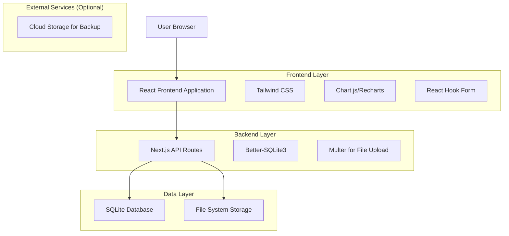
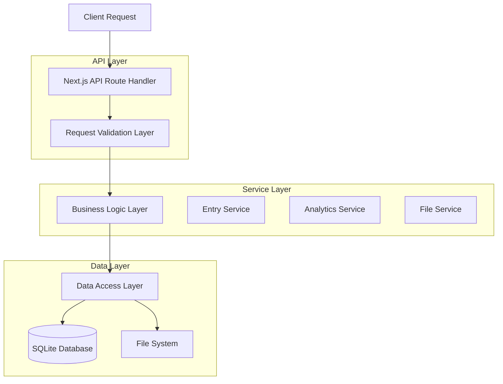
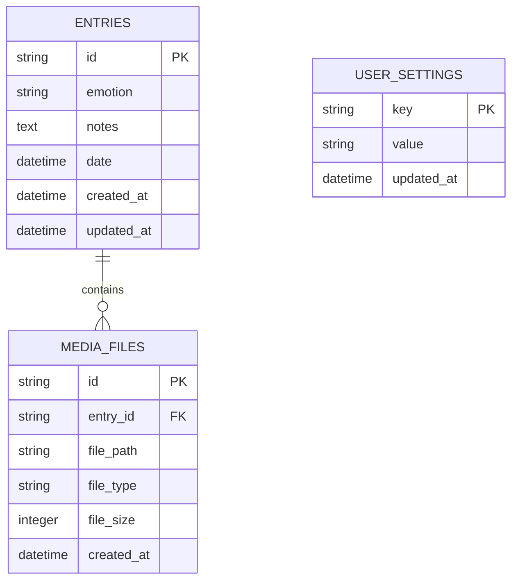

# Mood Journal App - Technical Architecture Document

## 1. Architecture Design



## 2. Technology Description

* Frontend: React\@18 + Next.js\@14 + TypeScript + Tailwind CSS\@3

* Backend: Next.js API Routes + Better-SQLite3

* Database: SQLite (local file-based database)

* Charts: Recharts or Chart.js for data visualization

* File Storage: Local file system for photos and voice notes

* State Management: React Context + useReducer

* Forms: React Hook Form with Zod validation

## 3. Route Definitions

| Route          | Purpose                                              |
| -------------- | ---------------------------------------------------- |
| /              | Homepage with quick entry widget and today's summary |
| /history       | History page with calendar view and entry list       |
| /trends        | Trends page with mood analytics and charts           |
| /entry/\[id]   | Individual entry detail and edit page                |
| /settings      | App settings and preferences                         |
| /api/entries   | API endpoints for mood entries CRUD operations       |
| /api/analytics | API endpoints for trend data and statistics          |
| /api/upload    | API endpoint for photo and voice note uploads        |

## 4. API Definitions

### 4.1 Core API

**Mood Entries Management**

```
POST /api/entries
```

Request:

| Param Name | Param Type | isRequired | Description                                        |
| ---------- | ---------- | ---------- | -------------------------------------------------- |
| emotion    | string     | true       | Selected emotion (happy, sad, anxious, calm, etc.) |
| notes      | string     | false      | Text notes (max 500 characters)                    |
| date       | string     | true       | Entry date in ISO format                           |
| photoPath  | string     | false      | Path to uploaded photo                             |
| voicePath  | string     | false      | Path to uploaded voice note                        |

Response:

| Param Name | Param Type | Description                  |
| ---------- | ---------- | ---------------------------- |
| success    | boolean    | Operation success status     |
| data       | object     | Created entry object with ID |

Example Request:

```json
{
  "emotion": "happy",
  "notes": "Had a great day at the park with friends!",
  "date": "2024-01-15T10:30:00Z",
  "photoPath": "/uploads/photos/entry_123.jpg"
}
```

```
GET /api/entries
```

Request:

| Param Name | Param Type | isRequired | Description                    |
| ---------- | ---------- | ---------- | ------------------------------ |
| startDate  | string     | false      | Filter entries from this date  |
| endDate    | string     | false      | Filter entries until this date |
| emotion    | string     | false      | Filter by specific emotion     |
| limit      | number     | false      | Number of entries to return    |
| offset     | number     | false      | Pagination offset              |

Response:

| Param Name | Param Type | Description              |
| ---------- | ---------- | ------------------------ |
| success    | boolean    | Operation success status |
| data       | array      | Array of mood entries    |
| total      | number     | Total number of entries  |

```
PUT /api/entries/[id]
```

Request: Same as POST but for updating existing entry

```
DELETE /api/entries/[id]
```

Response:

| Param Name | Param Type | Description             |
| ---------- | ---------- | ----------------------- |
| success    | boolean    | Deletion success status |

**Analytics and Trends**

```
GET /api/analytics/trends
```

Request:

| Param Name | Param Type | isRequired | Description                     |
| ---------- | ---------- | ---------- | ------------------------------- |
| period     | string     | false      | Time period (week, month, year) |
| startDate  | string     | false      | Analysis start date             |
| endDate    | string     | false      | Analysis end date               |

Response:

| Param Name       | Param Type | Description                  |
| ---------------- | ---------- | ---------------------------- |
| moodTrends       | array      | Daily mood data for charts   |
| emotionBreakdown | object     | Emotion frequency statistics |
| wordFrequency    | array      | Word cloud data              |
| streakData       | object     | Logging streak information   |

**File Upload**

```
POST /api/upload
```

Request: Multipart form data with file

| Param Name | Param Type | isRequired | Description                |
| ---------- | ---------- | ---------- | -------------------------- |
| file       | File       | true       | Photo or audio file        |
| type       | string     | true       | File type (photo or voice) |

Response:

| Param Name | Param Type | Description           |
| ---------- | ---------- | --------------------- |
| success    | boolean    | Upload success status |
| filePath   | string     | Path to uploaded file |
| fileSize   | number     | File size in bytes    |

## 5. Server Architecture Diagram



## 6. Data Model

### 6.1 Data Model Definition



### 6.2 Data Definition Language

**Mood Entries Table (entries)**

```sql
-- Create entries table
CREATE TABLE entries (
    id TEXT PRIMARY KEY DEFAULT (lower(hex(randomblob(16)))),
    emotion TEXT NOT NULL CHECK (emotion IN ('happy', 'sad', 'anxious', 'calm', 'excited', 'stressed', 'peaceful', 'frustrated', 'content', 'overwhelmed')),
    notes TEXT,
    date TEXT NOT NULL, -- ISO 8601 format: YYYY-MM-DDTHH:MM:SSZ
    created_at TEXT NOT NULL DEFAULT (datetime('now')),
    updated_at TEXT NOT NULL DEFAULT (datetime('now'))
);

-- Create indexes for better query performance
CREATE INDEX idx_entries_date ON entries(date DESC);
CREATE INDEX idx_entries_emotion ON entries(emotion);
CREATE INDEX idx_entries_created_at ON entries(created_at DESC);

-- Trigger to update updated_at timestamp
CREATE TRIGGER update_entries_timestamp 
    AFTER UPDATE ON entries
    FOR EACH ROW
    BEGIN
        UPDATE entries SET updated_at = datetime('now') WHERE id = NEW.id;
    END;
```

**Media Files Table (media\_files)**

```sql
-- Create media files table
CREATE TABLE media_files (
    id TEXT PRIMARY KEY DEFAULT (lower(hex(randomblob(16)))),
    entry_id TEXT NOT NULL,
    file_path TEXT NOT NULL,
    file_type TEXT NOT NULL CHECK (file_type IN ('photo', 'voice')),
    file_size INTEGER NOT NULL,
    created_at TEXT NOT NULL DEFAULT (datetime('now')),
    FOREIGN KEY (entry_id) REFERENCES entries (id) ON DELETE CASCADE
);

-- Create indexes
CREATE INDEX idx_media_files_entry_id ON media_files(entry_id);
CREATE INDEX idx_media_files_type ON media_files(file_type);
```

**User Settings Table (user\_settings)**

```sql
-- Create user settings table
CREATE TABLE user_settings (
    key TEXT PRIMARY KEY,
    value TEXT NOT NULL,
    updated_at TEXT NOT NULL DEFAULT (datetime('now'))
);

-- Insert default settings
INSERT INTO user_settings (key, value) VALUES 
    ('theme', 'light'),
    ('notifications_enabled', 'true'),
    ('reminder_time', '20:00'),
    ('first_day_of_week', '0'),
    ('data_retention_days', '365');
```

**Analytics Views for Performance**

```sql
-- Create view for daily mood summary
CREATE VIEW daily_mood_summary AS
SELECT 
    DATE(date) as day,
    emotion,
    COUNT(*) as entry_count,
    GROUP_CONCAT(notes, ' ') as combined_notes
FROM entries 
GROUP BY DATE(date), emotion
ORDER BY day DESC;

-- Create view for emotion statistics
CREATE VIEW emotion_stats AS
SELECT 
    emotion,
    COUNT(*) as total_count,
    ROUND(COUNT(*) * 100.0 / (SELECT COUNT(*) FROM entries), 2) as percentage,
    DATE(MIN(date)) as first_occurrence,
    DATE(MAX(date)) as last_occurrence
FROM entries 
GROUP BY emotion
ORDER BY total_count DESC;
```

**Sample Data**

```sql
-- Insert sample mood entries
INSERT INTO entries (emotion, notes, date) VALUES 
    ('happy', 'Beautiful sunny day, went for a walk in the park', '2024-01-15T09:30:00Z'),
    ('calm', 'Morning meditation session was very peaceful', '2024-01-15T07:00:00Z'),
    ('anxious', 'Big presentation tomorrow, feeling nervous', '2024-01-14T22:15:00Z'),
    ('content', 'Finished reading a great book today', '2024-01-14T19:45:00Z'),
    ('excited', 'Planning weekend trip with friends!', '2024-01-13T16:20:00Z');
```

