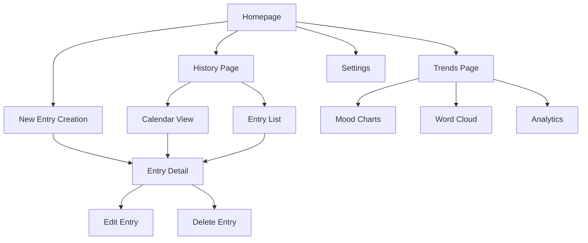

# Mood Journal App - Product Requirements Document

## 1. Product Overview

A personal mood tracking application that enables users to quickly log their daily emotions with text notes and optional media attachments. The app focuses on creating a calming, self-care experience that helps users understand their emotional patterns through intuitive logging and insightful analytics.

The product aims to support mental wellness by making mood tracking effortless and providing meaningful insights into emotional trends over time.

## 2. Core Features

### 2.1 User Roles

Since this is a personal mood journal app, no role distinction is necessary. All users have the same access to all features.

### 2.2 Feature Module

Our mood journal app consists of the following main pages:

1. **Homepage**: Quick emotion selector, new entry creation, today's mood summary
2. **History Page**: Calendar view, entry browsing, search and filter options
3. **Trends Page**: Mood line charts, word cloud visualization, emotion breakdown charts
4. **Entry Detail Page**: Full entry view, edit capabilities, media attachments
5. **Settings Page**: App preferences, data export, notification settings

### 2.3 Page Details

| Page Name    | Module Name        | Feature description                                                                                                                                                                                                                            |
| ------------ | ------------------ | ---------------------------------------------------------------------------------------------------------------------------------------------------------------------------------------------------------------------------------------------- |
| Homepage     | Quick Entry Widget | Select emotion from predefined options (happy, sad, anxious, calm, excited, stressed, peaceful, frustrated). Add text notes up to 500 characters. Optional photo upload from camera or gallery. Optional voice note recording up to 2 minutes. |
| Homepage     | Today's Summary    | Display current day's entries if any. Show mood trend indicator. Quick access to view/edit today's entries.                                                                                                                                    |
| Homepage     | Navigation Hub     | Easy access to history and trends pages. Motivational daily quote or tip. Streak counter for consecutive logging days.                                                                                                                         |
| History Page | Calendar View      | Monthly calendar with mood indicators on each day. Click date to view entries. Color-coded emotions for quick visual scanning. Navigation between months/years.                                                                                |
| History Page | Entry List         | Chronological list of all entries. Filter by emotion type, date range, or text content. Search functionality across entry text. Pagination for performance.                                                                                    |
| History Page | Entry Management   | Edit existing entries. Delete entries with confirmation. Bulk operations for multiple entries.                                                                                                                                                 |
| Trends Page  | Mood Timeline      | Line chart showing mood trends over time (weekly, monthly, yearly views). Interactive data points showing specific entries. Trend analysis with insights.                                                                                      |
| Trends Page  | Word Cloud         | Visual representation of frequently used words in entries. Click words to filter related entries. Dynamic sizing based on frequency.                                                                                                           |
| Trends Page  | Emotion Analytics  | Pie chart of emotion distribution. Bar chart of mood frequency. Statistics like most common emotion, mood stability metrics.                                                                                                                   |
| Entry Detail | Media Display      | Full-size photo viewing with zoom capabilities. Voice note playback with controls. Media download/share options.                                                                                                                               |
| Entry Detail | Entry Editor       | Rich text editing for notes. Emotion modification. Date/time adjustment. Media addition/removal.                                                                                                                                               |
| Settings     | Preferences        | Theme selection (light/dark/auto). Notification settings for daily reminders. Data backup and restore options. Privacy settings.                                                                                                               |

## 3. Core Process

**Daily Logging Flow:**
User opens app → Selects current emotion from homepage → Adds optional text note → Optionally attaches photo or records voice note → Saves entry → Views confirmation with encouragement message

**History Review Flow:**
User navigates to History page → Views calendar or list view → Clicks on specific date/entry → Reviews past entry details → Optionally edits or deletes entry

**Trends Analysis Flow:**
User navigates to Trends page → Selects time period for analysis → Views mood timeline chart → Explores word cloud for themes → Reviews emotion breakdown statistics → Gains insights into emotional patterns

## 4. User Interface Design

### 4.1 Design Style

* **Primary Colors**: Soft pastels - lavender (#E6E6FA), sage green (#9CAF88), warm beige (#F5F5DC)

* **Secondary Colors**: Muted blues (#B0C4DE), soft pinks (#F0E6FF), gentle grays (#F8F8FF)

* **Button Style**: Rounded corners (12px radius), soft shadows, gentle hover animations

* **Typography**: Inter or Poppins font family, 16px base size, generous line spacing (1.6)

* **Layout Style**: Card-based design with soft shadows, ample white space, gentle transitions

* **Icons**: Rounded, minimalist style with soft colors, emotion-specific iconography

* **Animations**: Subtle fade-ins, gentle scale transforms, smooth color transitions

### 4.2 Page Design Overview

| Page Name    | Module Name     | UI Elements                                                                                                                                                |
| ------------ | --------------- | ---------------------------------------------------------------------------------------------------------------------------------------------------------- |
| Homepage     | Quick Entry     | Large, colorful emotion buttons in grid layout. Floating action button for quick entry. Soft gradient backgrounds. Gentle micro-animations on interaction. |
| Homepage     | Today's Summary | Card-based layout with rounded corners. Soft color indicators for mood. Minimalist typography with breathing room.                                         |
| History Page | Calendar View   | Clean calendar grid with subtle emotion color dots. Smooth month transitions. Hover effects with gentle scaling.                                           |
| History Page | Entry List      | Card-based entries with emotion icons. Soft dividers between entries. Gentle loading animations.                                                           |
| Trends Page  | Charts          | Soft color palettes for data visualization. Rounded chart elements. Interactive tooltips with smooth animations.                                           |
| Entry Detail | Media Display   | Full-screen overlay with soft backgrounds. Gentle zoom animations. Minimalist control buttons.                                                             |
| Settings     | Preferences     | Toggle switches with soft colors. Card-based sections. Gentle confirmation dialogs.                                                                        |

### 4.3 Responsiveness

The app is designed mobile-first with responsive breakpoints for tablet and desktop. Touch interactions are optimized with appropriate button sizes (minimum 44px) and gesture support for swiping between calendar months and entry navigation.

* **Mobile (320px-768px)**: Single column layout, full-width cards, bottom navigation

* **Tablet (768px-1024px)**: Two-column layout for some sections, side navigation

* **Desktop (1024px+)**: Multi-column layout, hover states, keyboard shortcuts

