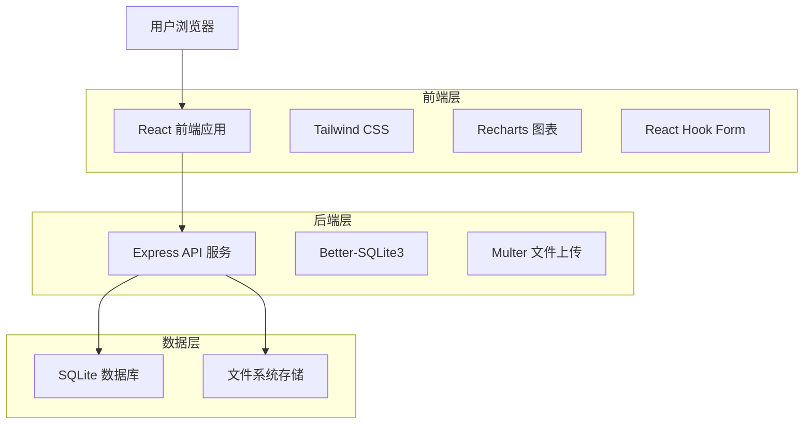

# MoodJournal App 🌈

一个优雅的个人情绪追踪应用，帮助用户记录日常情绪，通过直观的数据可视化了解情绪模式，支持心理健康管理。

用 AI IDE trae 构建。

## 📱 应用概览

MoodJournal 是一个专注于心理健康的情绪日记应用，提供简洁优雅的界面让用户轻松记录每日情绪状态。通过智能分析和可视化图表，帮助用户深入了解自己的情绪变化规律。

## ✨ 核心功能

### 🏠 首页 - 快速记录
- **情绪选择器**: 10种预设情绪（开心/Happy、悲伤/Sad、焦虑/Anxious、平静/Calm、兴奋/Excited、压力/Stressed、平和/Peaceful、沮丧/Depressed、满足/Content、不知所措/Overwhelmed）
- **文字记录**: 支持最多500字符的情绪笔记
- **今日总结**: 显示当天的情绪记录和趋势指示器
- **连续记录统计**: 追踪连续记录天数

### 📅 历史页面 - 回顾过往
- **日历视图**: 月历显示，每日情绪用颜色标识
- **条目列表**: 按时间排序的所有记录
- **搜索过滤**: 按情绪类型、日期范围或文本内容筛选
- **记录管理**: 编辑、删除现有记录

### 📊 趋势页面 - 数据洞察
- **情绪时间线**: 可交互的情绪变化趋势图（周/月/年视图）
- **词云分析**: 基于记录文本生成的词频可视化
- **情绪分析**: 饼图和柱状图展示情绪分布统计
- **趋势洞察**: 智能分析情绪稳定性和常见情绪

### 📝 记录详情 - 深度编辑
- **富文本编辑**: 完整的记录编辑功能
- **情绪修改**: 调整记录的情绪类型
- **时间调整**: 修改记录的日期和时间

### ⚙️ 设置页面 - 个性化配置
- **主题选择**: 浅色/深色/自动主题
- **多语言支持**: 国际化界面
- **数据管理**: 备份和恢复选项

## 🏗️ 技术架构

### 架构图



### 技术栈

#### 前端技术
- **框架**: React 18 + TypeScript
- **构建工具**: Vite
- **路由**: React Router DOM 7
- **样式**: Tailwind CSS 3
- **图表**: Recharts 3
- **表单**: React Hook Form + Zod 验证
- **状态管理**: Zustand
- **国际化**: i18next + react-i18next
- **图标**: Lucide React

#### 后端技术
- **运行时**: Node.js
- **框架**: Express.js
- **数据库**: SQLite + Better-SQLite3
- **文件上传**: Multer
- **跨域**: CORS
- **环境变量**: dotenv

#### 开发工具
- **代码检查**: ESLint
- **并发运行**: Concurrently
- **热重载**: Nodemon
- **类型检查**: TypeScript

## 🗂️ 项目结构

```
MoodJournal-app/
├── src/                    # 前端源代码
│   ├── components/         # React 组件
│   ├── pages/             # 页面组件
│   ├── hooks/             # 自定义 Hooks
│   ├── i18n/              # 国际化配置
│   └── lib/               # 工具函数
├── api/                   # 后端 API
│   ├── routes/            # API 路由
│   ├── database.ts        # 数据库配置
│   └── server.ts          # 服务器入口
├── shared/                # 共享类型定义
├── public/                # 静态资源
├── data/                  # SQLite 数据库文件
└── .trae/                 # 项目文档
    └── documents/         # 架构和需求文档
```

## 🚀 快速开始

### 环境要求

- Node.js >= 18.0.0
- pnpm >= 8.0.0 (推荐) 或 npm >= 9.0.0

### 安装步骤

1. **克隆项目**
   ```bash
   git clone https://github.com/jiujuan/moodjournal-app.git
   cd MoodJournal-app
   ```

2. **安装依赖**
   ```bash
   pnpm install
   # 或者使用 npm
   npm install
   ```

3. **启动开发服务器**
   ```bash
   pnpm dev
   # 或者使用 npm
   npm run dev
   ```

   这将同时启动：
   - 前端开发服务器 (http://localhost:5173)
   - 后端 API 服务器 (http://localhost:3002)

4. **访问应用**
   
   打开浏览器访问 http://localhost:5173

### 可用脚本

```bash
# 开发模式（前后端同时启动）
pnpm dev

# 仅启动前端
pnpm client:dev

# 仅启动后端
pnpm server:dev

# 构建生产版本
pnpm build

# 预览生产构建
pnpm preview

# 代码检查
pnpm lint

# 类型检查
pnpm check
```

## 📊 数据库设计

### 核心表结构

#### entries 表（情绪记录）
```sql
CREATE TABLE entries (
  id TEXT PRIMARY KEY,
  emotion TEXT NOT NULL,
  notes TEXT,
  date TEXT NOT NULL,
  created_at TEXT NOT NULL,
  updated_at TEXT NOT NULL
);
```

#### media_files 表（媒体文件）
```sql
CREATE TABLE media_files (
  id TEXT PRIMARY KEY,
  entry_id TEXT,
  file_path TEXT NOT NULL,
  file_type TEXT NOT NULL,
  file_size INTEGER,
  FOREIGN KEY (entry_id) REFERENCES entries(id)
);
```

## 🎨 设计系统

### 色彩方案
- **主色调**: 柔和紫色 (#E6E6FA)、鼠尾草绿 (#9CAF88)、温暖米色 (#F5F5DC)
- **辅助色**: 静谧蓝 (#B0C4DE)、柔粉色 (#F0E6FF)、温和灰 (#F8F8FF)

### 设计特点
- 圆角设计 (12px 圆角)
- 卡片式布局
- 柔和阴影效果
- 平滑过渡动画
- 简约图标风格

## 🌐 API 接口

### 情绪记录管理

```http
# 创建记录
POST /api/entries
{
  "emotion": "happy",
  "notes": "今天心情很好！",
  "date": "2024-01-15T10:30:00Z"
}

# 获取记录列表
GET /api/entries?limit=10&offset=0

# 更新记录
PUT /api/entries/:id

# 删除记录
DELETE /api/entries/:id
```

### 数据分析

```http
# 获取趋势数据
GET /api/analytics/trends?period=month

# 情绪统计
GET /api/analytics/emotions
```

## 🔧 部署指南

### 生产环境部署

1. **构建应用**
   ```bash
   pnpm build
   ```

2. **配置环境变量**
   ```bash
   # .env
   PORT=3002
   NODE_ENV=production
   ```

3. **启动生产服务器**
   ```bash
   node api/server.js
   ```

### Vercel 部署

项目已配置 `vercel.json`，支持一键部署到 Vercel 平台。

## 🤝 贡献指南

1. Fork 项目
2. 创建功能分支 (`git checkout -b feature/AmazingFeature`)
3. 提交更改 (`git commit -m 'Add some AmazingFeature'`)
4. 推送到分支 (`git push origin feature/AmazingFeature`)
5. 开启 Pull Request

## 📄 许可证

本项目采用 Apache License 2.0 许可证 - 查看 [LICENSE](LICENSE) 文件了解详情。

## 🙏 致谢

- [React](https://reactjs.org/) - 用户界面库
- [Tailwind CSS](https://tailwindcss.com/) - CSS 框架
- [Recharts](https://recharts.org/) - 图表库
- [Better-SQLite3](https://github.com/WiseLibs/better-sqlite3) - SQLite 数据库
- [Lucide](https://lucide.dev/) - 图标库

---

💝 **用心记录每一天的情绪，用数据洞察内心的变化** 💝
